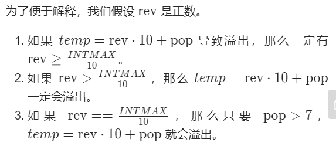

# Readme

## 	---7 integer reverse

### problem description

Given a 32 bits signed integer, you need to inverse every character in this integer 

### My solution

我的想法是，先通过循环除以10取余得到每一位数字存进数组，再逐个取出相加

本题主要需要解决的问题是

1. 负数
2. 相加后溢出的可能

我的解决方法：

1. 负数先转换成正数再颠倒
2. 相加前与INT_MAX值先做比较，如果溢出直接赋值0

### Other solutions

基本都集中在相加前先比较



但我个人的代码不够简洁，还有待优化

### *PS: My codes

```c++
class Solution {
public:
    int reverse(int x) {
        bool flag = true;
        
        if(x < 0) {
            if(x == INT_MIN) return 0;
            flag = false;
            x = 0-x;
        }

        int count = 0;
        int a[20];
        do{
            a[count] = x % 10;
            count ++;
            x = x / 10;
        }while(x != 0);
        int result = 0;
        for(int i = 0;i < count;i ++){
            long t = pow(10,count-i-1);
            long long add = a[i] * t;
            if(add > INT_MAX) return 0;
            result += (a[i] * t);
        }
        if(!flag) {
            result = 0 - result;
            if(result > 0) return 0;
         }
         else{
             if(result < 0) return 0;
         }
        return result;

    }
};

```

